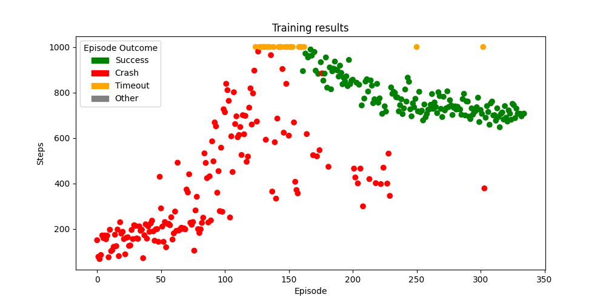
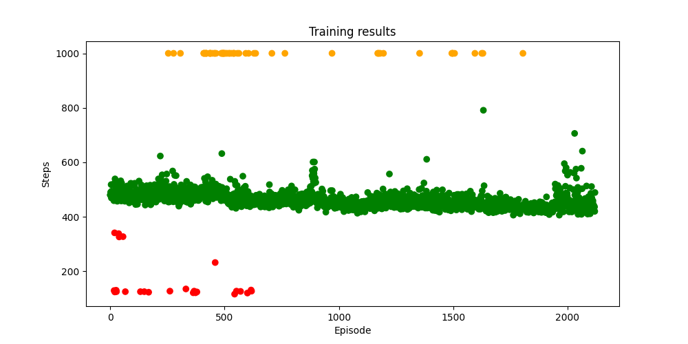
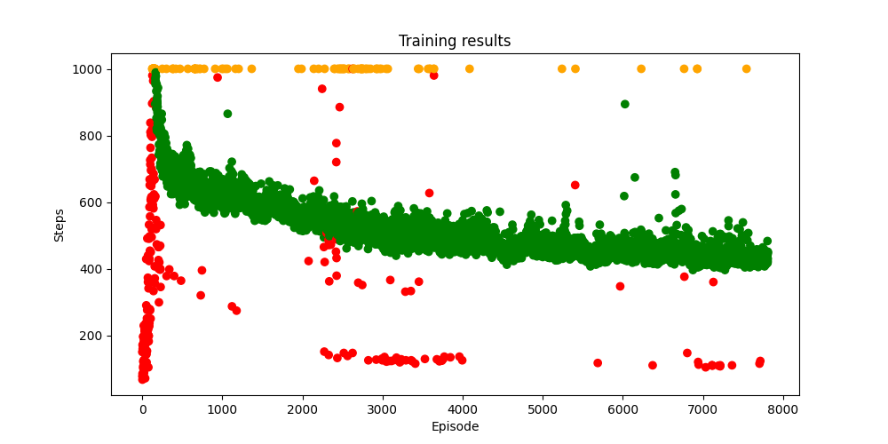
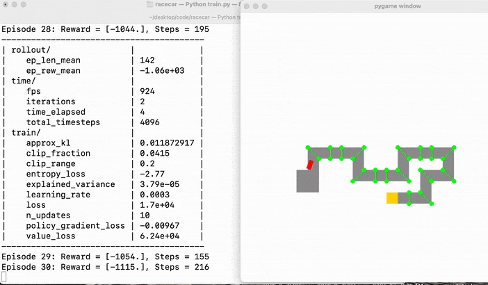
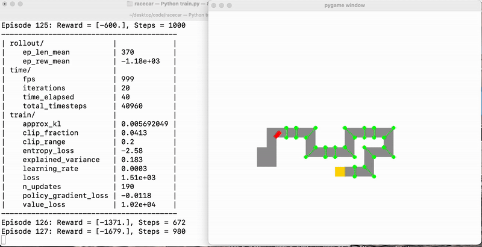
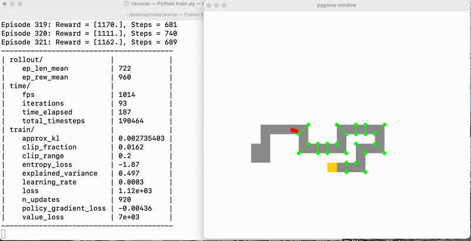
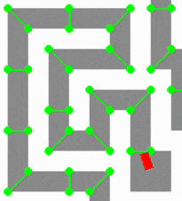
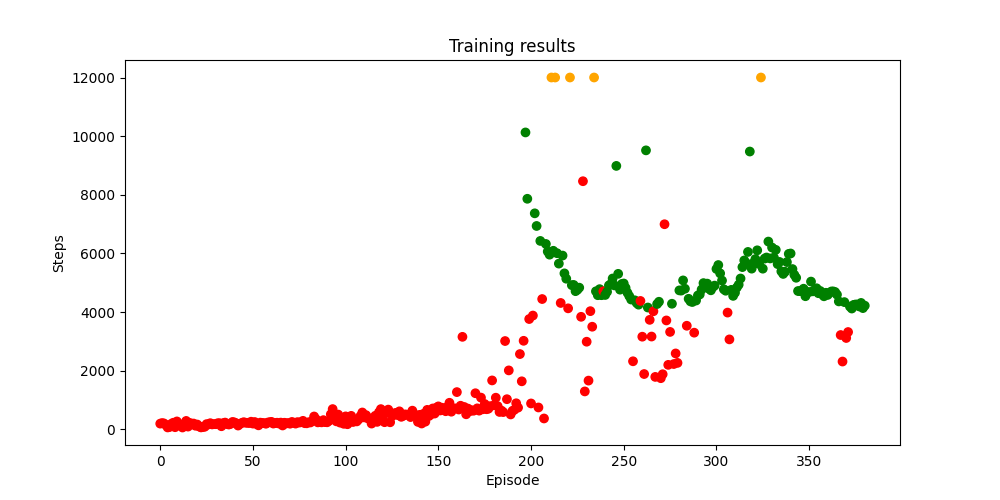
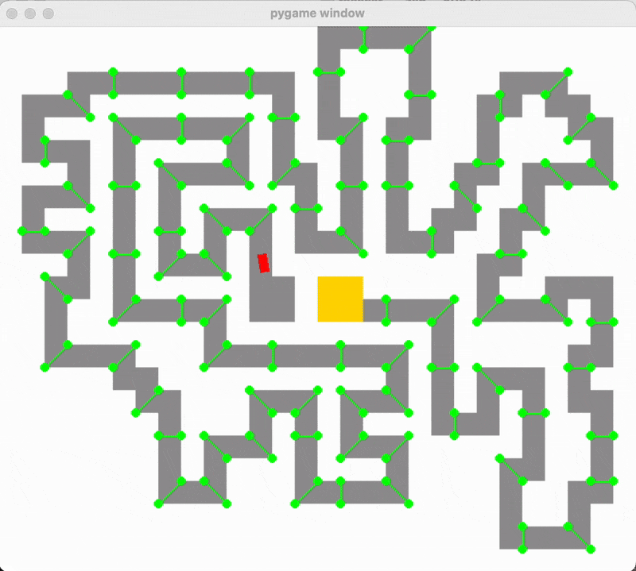

# RL Agent Race Car
Playing a 2D Racecar Game with a Reinforcement Learning Agent

### Features

- Training a configurable agent on a 2D race car track
- Record and graph training metrics
- Race against the agent
- Track editor

Agent capabilities:

- Can achieve really fast completions on short tracks; completed one track in 361 timesteps where the human best run was 371 timesteps
- Generalization: once being trained on one track, can run well on an entirely new track with similar features

### About

This repo uses the `Stable-Baselines3` library along with `Gymnasium` to train an agent within a custom environment (`RacecarEnv`). The agent is trained using the Proximal Policy Optimization (PPO) algorithm, an on-policy method which effectively balances exploitation and exploration. 

For decision-making, the agent uses a multi-layer perceptron (MLP) neural network which takes the observation space (raycast distances and car speed) as input, and outputs binary decisions corresponding to the action space (acceleration, braking, and steering). 

The environment (`RacecarEnv`) wraps a `Game` instance and provides structured observations and rewards, while a callback periodically renders the agent's behavior using a Pygame-based GUI.

#### Training

In the early stages of training, the agent behaves erratically, often crashing and failing to reach the goal as it explores the environment and collects initial experiences. Its actions are largely random, and reward signals are sparse or highly variable. 

<p align="center">
  <br/>
  <em>Early training process (0 - 200,000 timesteps).</em>
</p><br/>

Over time, as training progresses, the agent starts to complete the track consistently, and gradually improves its speed. In late-stage training the agent shows more stable behavior and slower incremental gains as it converges toward a more optimal policy.

<p align="center">
  <br/>
  <em>Late-stage training (1,000,000 - 2,000,000 timesteps).</em>
</p><br/>

Overall throughout the training process, the agent converges closer and closer to a "theoretically perfect" policy. In late-stage training, the agent consistently completes episodes within a narrow range of step counts, showing that it has developed a reliable strategy.

There are still occasional failures, which displays the balance between exploitation (using the learned policy) and exploration (testing new actions) in training.

<p align="center">
  <br/>
  <em>Overall training process (0 - 4,000,000 timesteps).</em>
</p><br/>

#### Training Demos

<p align="center">
  <br/>
  <em>Early-stage training</em>
</p><br/>
<p align="center">
  <br/>
  <em>Mid-stage training</em>
</p><br/>
</p><br/>
<p align="center">
  <br/>
  <em>Late-stage training</em>
</p><br/>

#### The neural network

As mentioned before the NN's input is essentially the observation space. This consists of raycast distances at various angles relative to the car's heading (for most of this project I used -90˚, -45˚, -22.5˚, 0˚, 22.5˚, 45˚, and 90˚), and also the car's current speed. So for N raycasts there would be N+1 input nodes.

I also tried training another agent with more raycast angles: `[-90.0, -45.0, -33.75, -22.5, -11.25, 0.0, 11.25, 22.5, 33.75, 45.0, 90.0]`. With more raycasts, the agent has a finer perception of the surrounding environment. But since in my game the tracks were all strictly axis-aligned, this may not have been too helpful. 

Using more raycasts (i.e. more NN inputs) increases the time required for the agent’s policy to converge. For example, I couldn’t train an agent with 11 raycasts to match the speed of the original 7-raycast agent within a reasonable amount of training time (under 1 hour).

#### Reward function for speed

The only direct feedback that the agent receives is through the reward function. A poorly designed reward function can cause unintended shortcuts and suboptimal actions.

The reward function I used was simple and worked decently well:
- If the car crashes, the agent receives a penalty of -100. 
- If the goal tile is reached, the agent is given a reward of +100. 
- Otherwise, during "normal" driving, the agent receives a reward of `4 * (car_speed / max_car_speed_allowed) ^ 2` every frame. 

Making the reward increase quadratically at higher speeds encourages the agent to more heavily prefer higher speeds. 

Using a higher magnitude penalty for crashing results in the agent driving more carefully, since there's a greater incentive for it to avoid crashing. 

Conversely, using a smaller penalty results in the agent driving more recklessly, since the agent will prioritize collecting speed rewards. 

So, tweaking the constants in the reward function during the training can help the agent prioritize different things.

#### Reward function for stamina

Apart from being able to drive quick, I wanted the AI to be able to finish extremely long tracks.

I tried training an agent on a long track with the reward function from earlier, but soon enough there was a problem: the agent kept driving toward corners and then staying there for a long time. 

<p align="center">
  <br/>
  <em>Car becoming stuck near corners</em>
</p><br/>

I guessed that the agent, having never seen these corners before, would resort to doing completely random actions while trying to avoid crashing. So, over a period of time the car would average to staying mostly still.

Without an incentive, it was very unlikely that the agent would learn to U-turn on its own. 

So, I updated the reward function, adding a penalty if the car stayed mostly still for too long.

```python
# punish staying in the same 25x25 unit for >100 timesteps
x, y = self.game.car.center
unit = (int(x // 25), int(y // 25))
idle_penalty = 0
if self.last_unit == unit:
    self.unit_stay_count += 1
    if self.unit_stay_count > 100:
        idle_penalty = -20  # later added to this timestep's total reward
else:
    self.last_unit = unit
    self.unit_stay_count = 1
```

I also added an additional raycast pointing behind the car so that the agent can better determine if it is approaching a corner, and whether it is appropriate to U-turn. So, the final set of raycasts I used was `[-90.0, -45.0, -22.5, 0.0, 22.5, 45.0, 90.0, 180.0]`

Final reward function for "stamina" / long track training:

- If the car crashes, give a penalty of -1000. 
- If the run exceeds 12000 timesteps, give a penalty of -1000 (and truncate the run).
- If the goal tile is reached, give a reward of +1000. 
- If the agent has stayed within the same 25x25 unit for more than 100 consecutive timesteps, add a penalty of -20.
- When a waypoint is reached, add a reward of +10.

<p align="center">
  <br/>
  <em>Training on the long track (1,000,000 timesteps).</em>
</p><br/>

The agent takes much longer to initially get a successful run. But after stumbling a lot near the beginning, the agent learns the rest of the track very quickly (since it has already seen many features / repeated patterns in the track).

<p align="center">
  <br/>
  <em>The agent completing the long track.</em>
</p><br/>

#### Future improvements

- The agent does poorly when the track requires a big turn immediately at the beginning
  - Ex: when the correct route is initially behind the car at spawnpoint, so it has to make a U-turn
  - Reason: my guess is that the agent has a hard time "discovering" the turn via random exploration. At the very beginning of training the agent is just selecting random actions, so on average the agent will tend to favor moving forward.

- Make the game more complex. Currently:
  - Game physics is very rigid
  - Track is on a 2D square grid
  - No complex mechanics like drifting, or the car being airborne
  - In the future for a complex game, might require more inputs (axes of rotation, angular velocity/accel, distance to waypoints, etc) and longer training time